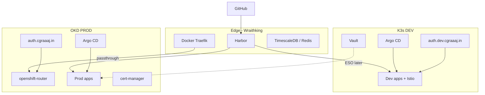

# TARGET_ARCHITECTURE

## Principles

1. **K3s = dev**, **OKD = prod** — validate on dev, promote digest to prod
2. **Greenfield prod installs** — no pod/PVC migration from K3s
3. **Prefer OKD native** — Routes, OAuth, built-in monitoring, SCC
4. **Shared external services** — Harbor, Vault (initially), Docker Traefik edge
5. **Separate Authentik per environment** — `auth.dev` vs `auth.cgraaaj.in`

## Layer Model

```
Layer 0  GitHub (source) + GitHub Actions (CI)
Layer 1  Harbor (artifacts, scanning, digests)
Layer 2  K3s DEV (validate charts, integration test)
Layer 3  OKD PROD platform (GitOps, IdP, storage, observability)
Layer 4  OKD PROD applications (business workloads)
Layer 5  External data (TimescaleDB, Redis, NAS) — network-attached
Layer 6  Edge (Docker Traefik on Wraithking) — public DNS termination/passthrough
```

## Target Topology



## OKD Provides vs External

| Capability | OKD native | External / shared |
|------------|------------|-------------------|
| Ingress | openshift-router, Routes | Traefik (public edge) |
| TLS (custom domains) | Route + cert-manager | Cloudflare DNS |
| Auth (cluster login) | OAuth + Routes | Authentik (per env) |
| Metrics | Prometheus, Alertmanager | HyperDX / ClickHouse (apps) |
| Registry pull | Image pull secrets | Harbor |
| Secrets | Secrets, SCC | Vault + ESO |
| Block storage | local-path (workers) | NAS NFS (future) |
| GitOps | Argo CD (to bootstrap) | GitHub |

## Naming Conventions

| Environment | Pattern | Example |
|-------------|---------|---------|
| Prod public | `service.cgraaaj.in` | `auth.cgraaaj.in`, `argocd.cgraaaj.in` |
| Dev public | `service.dev.cgraaaj.in` | `auth.dev.cgraaaj.in` |
| OKD internal | `*.apps.okd.cgraaaj.in` | Console, OAuth callback |

## Repo Layout (this monorepo)

| Path | Responsibility |
|------|----------------|
| `okd-services/` | How to deploy (Helm values, manifests, README) |
| `okd-gitops/` | Argo CD Applications (what deploys where) |
| `okd-policies/` | Admission / RBAC policies (when justified) |
| `docs/` | Architecture and rollout plans |
